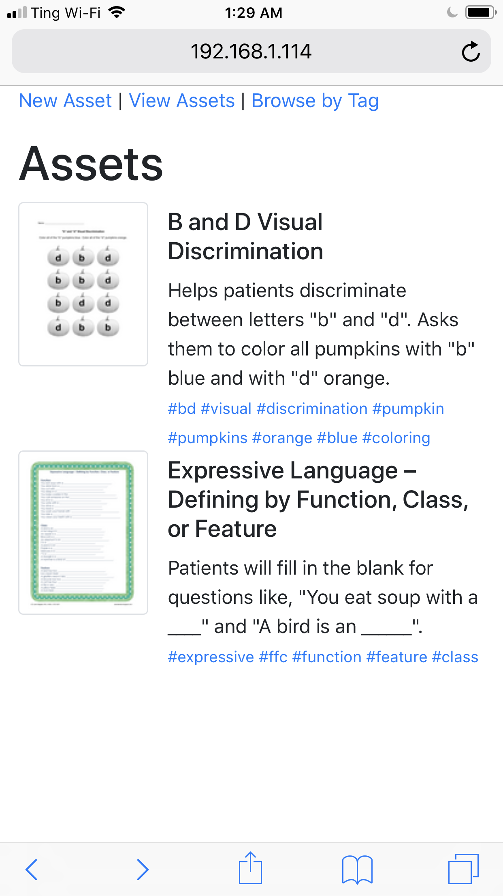

At REDACTED, our speech language pathologists (SLPs) deal mostly with young
children. As such, they will often make use of materials during their therapy
sessions - handouts, worksheets, picture cards, etc. (this blog has some
examples of the type of materials a SLP might use:
http://slpmaterials.blogspot.com/)

The goal of this project is to create a (very) small Ruby on Rails application
that encapsulates the following functionality:

+ a user can upload a material resource they have created to share with others
+ a user can search / download from the library of resources that users have
  uploaded

Try to limit yourself to 10 hours or less for this project.

DO

+ Focus on the user experience. It should be first and foremost easy-to-use and
  functional. Bonus points for an aesthetically pleasing design (if it doesn't
  take away from the functionality).

DON'T

+ Spend time playing code golf. The code for this project should be relatively
  vanilla and straightforward. Your time will be best spent thinking about and
  working on the user experience.

## Considerations

This was a 10-hour-or-less demo. As such, there are some things that I'd do
differently if this was a full-blown application.

I didn't bother with tests this time around. That might have been a mistake;
I might have actually finished some parts of the code _faster_ had I started
with `rspec` right off the bat.

Even in development, were this a "real" app I'd use PostgreSQL, not SQLite. I
ran into a number of database locks while testing things in development, leading
to some very odd errors I've never seen before. For a demo app though, SQLite is
"good enough".

In terms of the tags system of classification, I like the idea of using multiple
topics to classify a "thing". Different people might look for the same resource
by thinking of it in different ways, hence the hashtag system. However, in a
full-blown app I'd skip the browse-by-tag functionality since the list will be
huge and instead implement a search form with autocomplete and perhaps
automatic display of results that match all the hashtags entered in real time.

Finally, the UX is pretty vanilla. It's just twitter bootstrap right now. You
could theoretically over-design the hell out of this and get really fancy, but
it's a < 10 hour demo app, so I think it's "fair" as it is.

## Running it

**You need `graphicsmagick` (or `imagemagick`) AND `poppler` libraries installed
before you start.** On MacOS, this is as easy as:

```
$ brew install graphicsmagick poppler
```

This is so we can generate previews of PDF documents. Without that, we won't
have any thumbnails to look at.

After cloning the app, and from within the app directory:

```
$ bundle
$ be rake db:migrate
$ be rails s -b 0.0.0.0
```

Navigate to http://localhost:3000 and you can start uploading/tagging stuff.
